# Bar Bending Schedule [BBS] Estimate of Steel in Building Construction

# Introduction to Bar Bending Schedule [BBS]

“BBS” The word BBS Plays a significant role in any construction of High rise buildings. BBS refers to Bar Bending Schedule. Well, What’s the use of BBS? Why we use BBS? What is BBS?

First of all, **Bar** is any type of rebar which is used as a reinforcement in RCC. The bar may be a **Mild Steel** **bar** or **HYSD bar** or **TMT Bar**.

Bar Bending Schedule is termed as “Calculation of the total Steel required for the construction of a building” We use steel to make concrete to be reinforced and for tension requirements. But how much steel required for constructing 15 floors building? How much Steel I have to order? All these questions are answered in BBS

In Bar bending schedule, the bars are organized for each structural units (Beams or columns or slabs or footings etc) and detailed list is prepared which specifies the Bar location (Bar in footings, slabs, beams or columns), Bar Marking (to identify the bar in accordance with the drawing), Bar Size (length of the bar used), Quantity (No. of Bars used), Cutting length, Type of Bend and Shape of the bar in reinforcement drawings. 

### How BBS Changed from 1950-2019:-

From 1950 to 2019 lots of modifications and enhancements happening in our world. In 1950, three-storeyed buildings are high rise buildings now we are constructing a building with 200 floors+. There is a massive growth in the construction industry. Due to the vast increase in world population demands increased facilities, more need for space and more construction.

Father of Estimation **B.N. Datta** has given certain recommendations for the usage of steel in different components of buildings. But, he didn’t mention any values if we use more bars in a single structural member.

| Bar Bending Member | Percentage                        |
| :----------------- | :-------------------------------- |
| Slab               | 1% of total volume of concrete    |
| Beam               | 2% of of total volume of concrete |
| Column             | 2.5% of total volume of concrete  |
| Footings           | 0.8% of total volume of concrete  |

At that time we’ve used only four bars in [columns](https://civilread.com/different-types-columns/); now we are using 12+ bars in columns based on [load analysis](https://civilread.com/different-types-of-loads/). So, the percentage of steel is increased in a column which reveals that the above-cited values are outdated. ( They are outdated “not wrong”) He wrote that book in 1950. Now we are in 2019. He gave recommendations according to the potentiality of construction at that time. Now we are constructing 200 + floors in the small area.

# Bar Bending Schedule [BBS]:-

Before dealing with the BBS, it’s very important to learn the basics of Bar bending schedule. The below-mentioned table is a kick-start guide for learning Bar bending schedule from scratch.

*(If you are viewing the below table through mobile, scroll horizontally for a clear view)*

| S.No. | Particulars                                                  | Result                        |
| :---- | :----------------------------------------------------------- | :---------------------------- |
| 1.    | Standard Length of the Steel Bar (Bars are sold at standard Length)  | 12m or 40'                    |
| 2.    | Weight of Bar for length = 1m                                | D2/162  (were D = Dia of Bar) |
| Ex:   | If length of bar is 12m with 10mm Dia then , Weight of bar = D2/162  Therefore for length 1m = 1m x D2/162 = 1 x 102/162 = 0.61 Kgs  For length 12m = 12 x 102/162 = 7.40Kgs | 7.40Kgs                       |
| 3.    | Density of Steel                                             | 7850Kg/m3                     |

Below I am discussing the different concepts of Bar Bending schedule which are very useful while working with BBS. All these concepts are used in BBS design calculation of any structural member. So be familiar with the below concepts. To keep it clear, firstly the concepts are discussed and in the end, this post is closed with an example of BBS calculation of a member.

## 1. Hook Length or Cutting length of Stirrups:-

The hook length is commonly provided for stirrups in beams and ties in columns. In general, Hooks are added at the two ends of the rebar in stirrups or ties.

Hook Length = 9d (d is dia of the bar)

Below image makes you clear why the Hook length = 9d

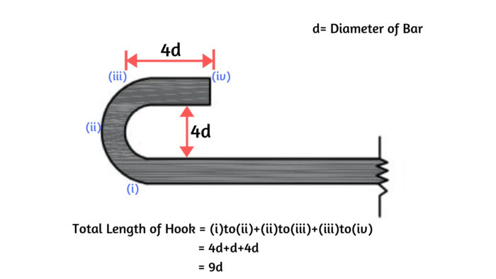

From above fig, length of hook = [(Curved Portion) + 4d] = [(4d+d)+4d] = 9d

**Hook Length = 9d [d is Diameter of the Bar]**

**Example Calculation considering stirrup with the hooks at ends:**

For clear understanding, look at the below image for calculation of the total length of stirrup the with two hooks at ends.

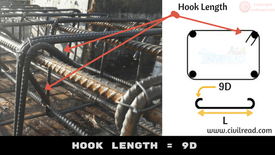

Total Cutting Length of stirrup or tie = Total length of Bar + 2 x Hook Length (Two hooks)

Total Cutting Length = L+2(9d)

Therefore Total Cutting length = L+18d (d is the Diameter of a bar)

Hope, now you are clear with the Hook length calculation.

## 2. Bend Length:-

The Bend length calculation is different for Cranked bars (bent up bars) and bends at corners.

The bars are usually cranked in Slabs and bars are bent at corners in Stirrups or ties.

### (i) Bend Length calculation in Cranked Bars:-

As Shear stress is maximum at supports in Slab. To resist these stresses we usually crank the bars at the ends of supports in the slab. The below figure depicts the bent up bar in Slab. To calculate the bend length the below procedure is followed.

 

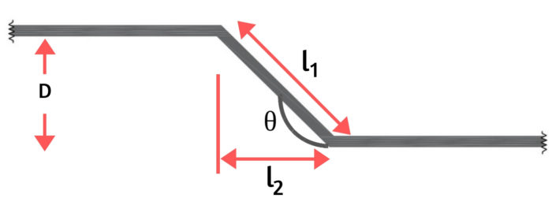

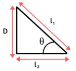

 

From the above figure as the bar is bent at an angle θ0 the additional length (la) is introduced.

Where, la = l1 – l2–(i)

Tanθ = D/l2 ; Sinθ = D/l1

Hence l1 = D/Sinθ and l2 = D/tanθ

Therefore from (i) :- la = D/Sinθ – D/tanθ

Giving different θ values as 300 , 450, 600 results different additional length la values as below.

| **θ°** | **D/Sinθ** | **D/tanθ** | **$$l_{a}={{D/\sin\theta}\over{D/\cos\theta}}$$** |
| :----: | :--------: | :--------: | :-----------------------------------------------: |
|  30°   |  D/0.500   |  D/0.573   |                       0.27D                       |
|  45°   |  D/0.707   |  D/1.000   |                       0.42D                       |
|  60°   |  D/0.866   |  D/1.732   |                       0.58D                       |
|  90°   |    D/1     |     0      |                        1D                         |
|  135°  |  D/0.707   |    D/-1    |                       2.42D                       |

The additional length is added to the total length of the bar if the bars are cranked at a certain angle.

### (ii) Bend Length calculation when bars are bent at corners:-

The important standards used while calculating the bend length at corners

1. 45° Bend length = 1d

   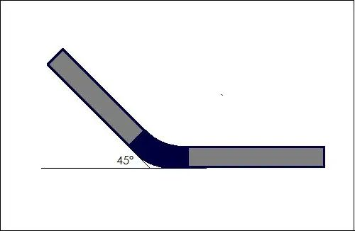

2. 90° Bend length = 2d

   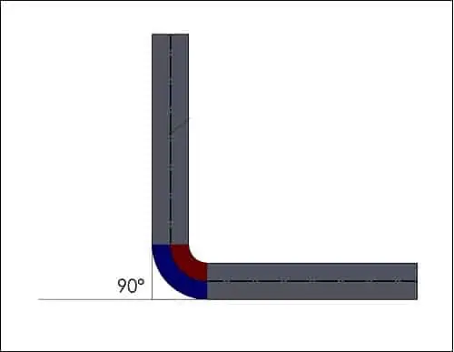

3. 135° Bend length = 3d

   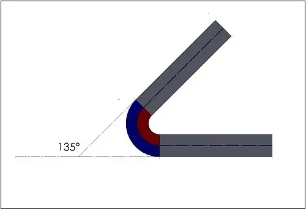

4.  180° Bend length = 4d

    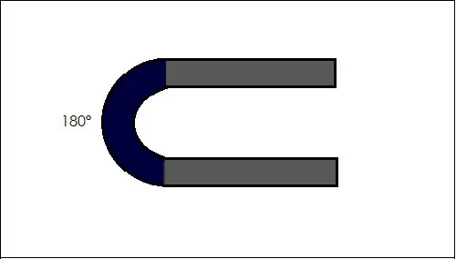

Here, ‘d’ = Diameter of bar

Below table represents the total length of bar calculation for different types of bar shapes.
*(If you are viewing the below table through mobile, scroll horizontally for a clear view)*

| Bar Shapes                                                   | Total Length of Hooks     | Total Bend Length                    | Total Length of Bar                  |
| :----------------------------------------------------------- | :------------------------ | :----------------------------------- | :----------------------------------- |
| **Straight Bar** 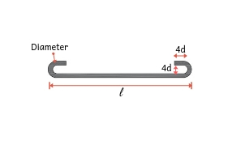 | Two Hooks = 9d + 9d = 18d | No bend                              | l + 18D                              |
| **Bent Up at one End only** 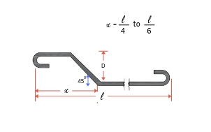 | Two Hooks = 9d + 9d = 18d | One bend bent at an angle 45 = 0.42D | l + 18D + 0.42D                      |
| **Double Bent up Bar** 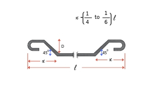 | Two Hooks = 9d + 9d = 18d | Two bends bent at an angle 45        | l + 18D + 0.42D + 0.42D =l+18D+0.84D |
| **Overlap of bars** 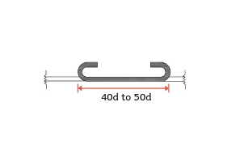 | Two Hooks = 9d + 9d = 18d | No bends                             | Overlap Length =(40d to 45d)+18d     |

## 3. Overlap Length / Lap Length in Reinforcement:-

The standard length of Rebar is 12m. Suppose the height of the column is 20 m. To purvey this requirement, two bars of length 12m and 8m are overlapped (joined) with overlap length.

**Overlap Length for compression members (columns) = 50d**

**The Overlap Length for tension members (beams) = 40d**

**[d is the Diameter of the bar]**

**[d is the Diameter of the bar]**

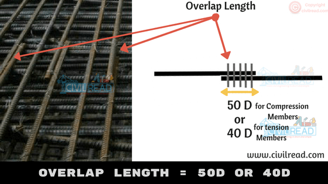

Have You seen the below picture on your top floor of the building? We generally project some length of Bar on the last floor i.e., 50D. It is used for further construction purpose. (Constructing a new floor)

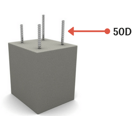

# Important rules while preparing Bar Bending Schedule:-

- The bars used in building should be grouped together for each structural unit and listed seperately for each floor.
- Bars are listed in numerical order.
- To identify the bar in the bundle of bars, each bar is uniquely labelled with reference details (Length of the bar, size of the bar, Shape of the bar)
- The type of bar and shape of the bar should be in accordance with B8666.
- It is essential that the bar mark reference on the label attached to a bundle of bars refers uniquely to a particular group or set of bars of defined length, size, shape and type used on the job.
- The cutting length and bending length calculations are separately calculated and not included in the detailed list. Like I have listed the Bar Bending details in a table and calculations are done separately.

# Use of Bar Bending Schedule:

- BBS helps to estimate the total quantity of steel required for the construction of building or structure. It helps to quote for tender the cost incurred by steel.
- Finding the cutting length and bending length in reinforcement detailing improves the quality of construction and minimize the wastage of steel, makes an economic construction
- With the help of reinforcement drawings, cutting and bending can be done at the factory and transported to the site. This increases faster construction and reduces the total construction cost.
- For site engineers, It becomes easy to verify the cutting length and bending length of the reinforcement before placing the concrete.